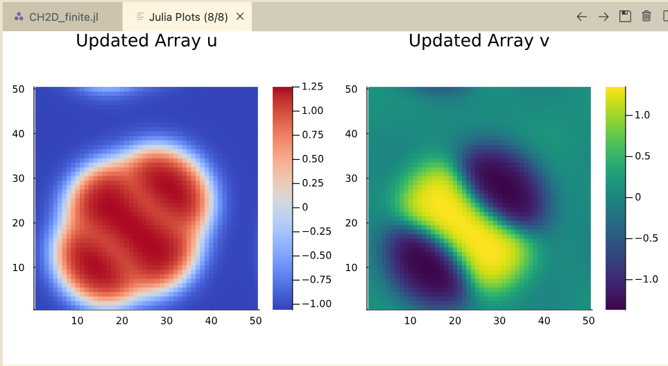

# cahn-hilliard-2D-finite-differences
Finite differences solution of coupled Cahn-Hilliard equations in multiple dimensions.

The dynamics of the state of the two mixed systems under consideration, $u$ and $v$ evolves to minimize the value of
an energy functional in the following expression: 


$$
F_{\epsilon_u, \epsilon_v ,\sigma }(u,v) = \int_{\Omega} \left( \frac{\epsilon_u^2}{2} |\nabla u|^2 + \frac{\epsilon_v^2}{2} |\nabla v|^2 + W(u,v) + \frac{\sigma}{2} \left| (-\Delta)^{-1/2} (v - \overline{v}) \right|^2 \right) \ dr  \tag{1}
$$


where

$$
W\left( u,v\right) =\frac{\left( u^{2}-1\right) ^{2}}{4}+\frac{\left(
v^{2}-1\right) ^{2}}{4}+b_1 uv-b_{2}\frac{uv^{2}}{2}   \tag{2}
$$


The associated Euler-Lagrange system of equations corresponding to the mixed
system  are two coupled  CH equations, as follows:

$$
\tau_u u_t = -\Delta \left( \epsilon_u^2 \Delta u + (1-u)(1+u)u - b_1 v + \frac{b_2}{2} v^2 \right)  \tag{3}
$$

and

$$
\tau_v v_t = -\Delta \big( \epsilon_v^2 \Delta v + (1-v)(1+v)v - b_1 u + b_2 uv \big) - \sigma (v - \overline{v})   \tag{4}
$$

The provided code uses a semi-implicit discretization to compute a finite differences solution of Eqs. (3) and (4).




## References
For further reading, you can refer to the following article:

```bibtex
@Article{Avalos2016,
  author    = {Avalos, Edgar and Higuchi, Takeshi and Teramoto, Takashi and Yabu, Hiroshi and Nishiura, Yasumasa},
  title     = {Frustrated phases under three-dimensional confinement simulated by a set of coupled Cahn-Hilliard equations},
  journal   = {Soft Matter},
  year      = {2016},
  volume    = {12},
  pages     = {5905-5914},
  doi       = {10.1039/C6SM00429F},
  issue     = {27},
  publisher = {The Royal Society of Chemistry},
  url       = {http://dx.doi.org/10.1039/C6SM00429F},
}


